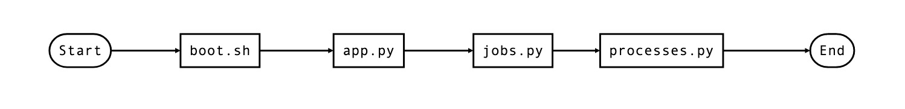
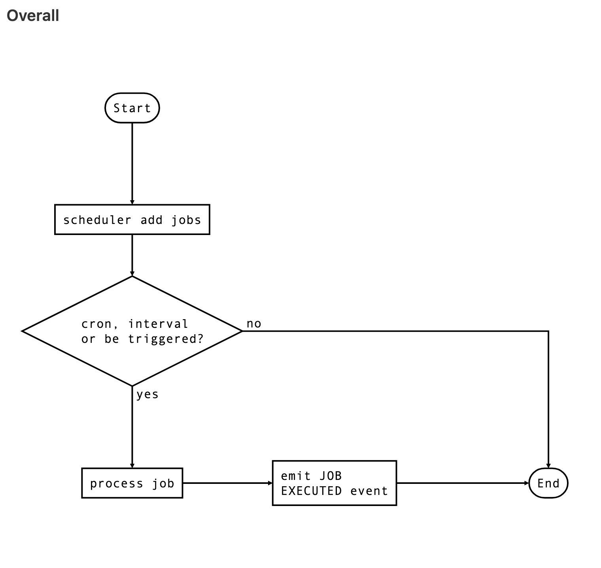
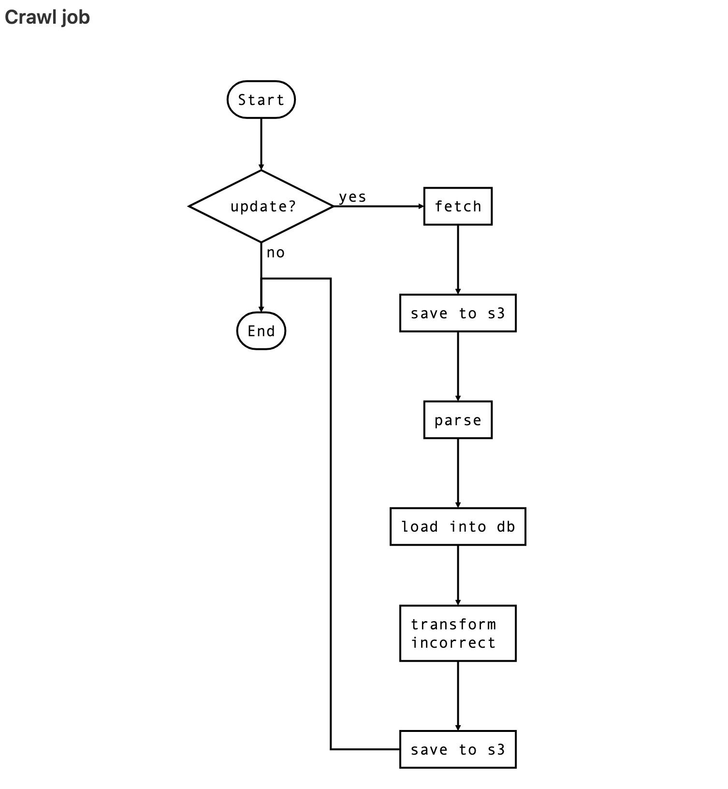
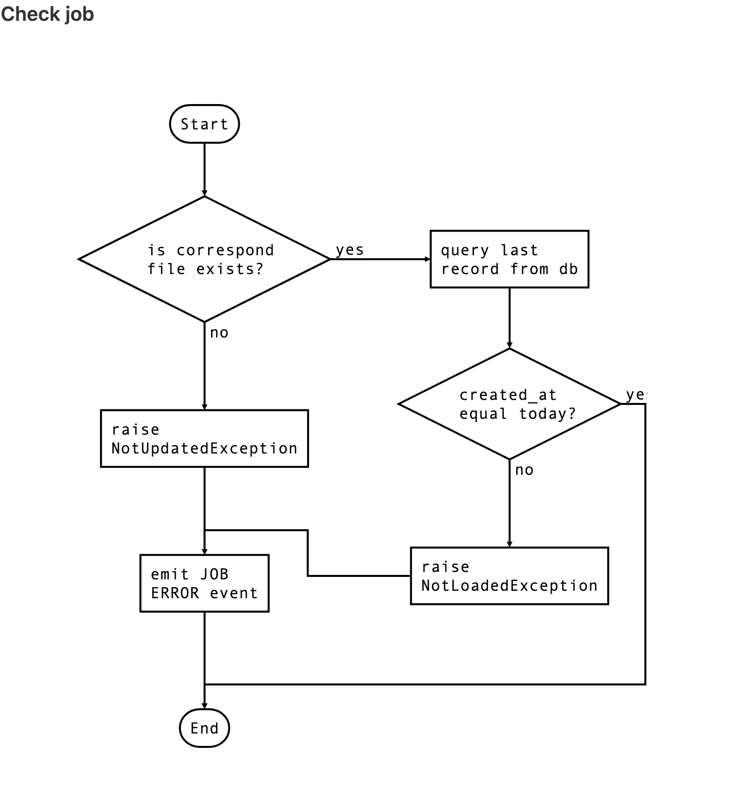
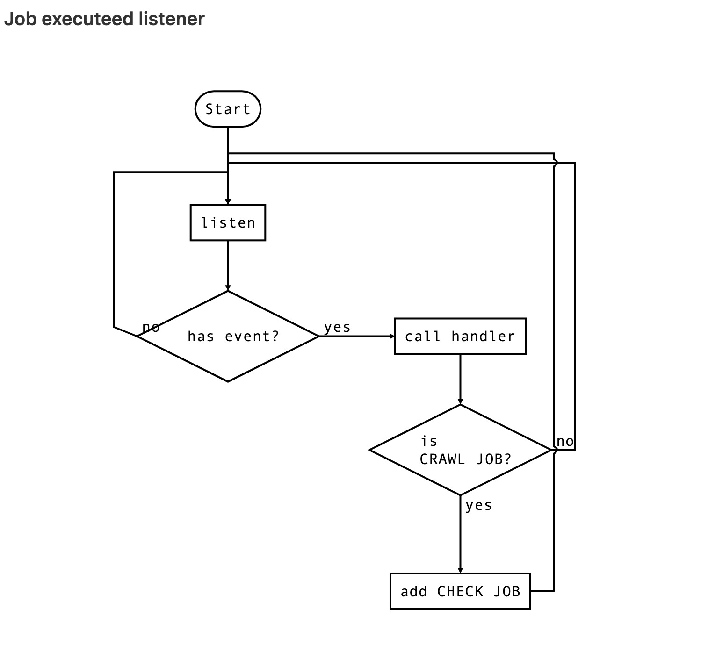
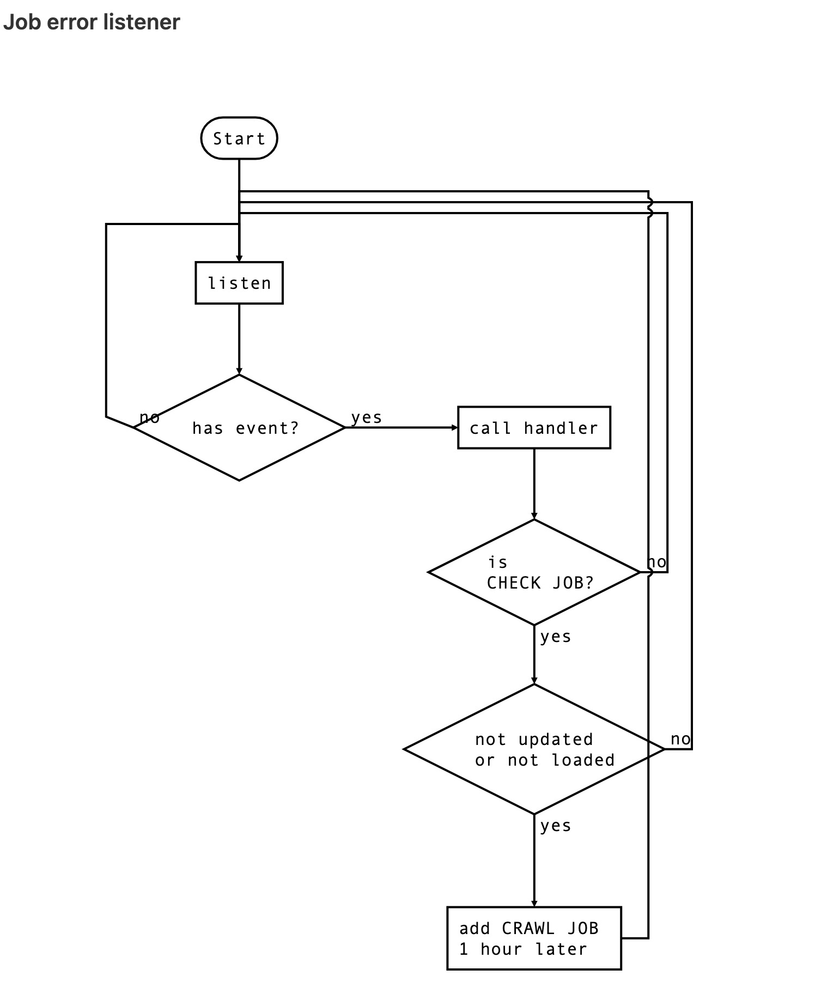

# pshouse schedule
擷取預售案實價登錄的排程 pre-sale house schedule

## 描述

關於**預售屋實價登錄**的 EtL 實作，於每月 1 號、11 號及 21 號從內政部網站下載預售屋實價登錄，並檢查資料是否已備份及更新 database。
除了新增歷史資料以外，也能更新淡水區 2022 年按月及按預售案分類的平均總價、平均房價及平均單價統計表資料。

首先擷取資料並上傳 AWS S3 備份。其次利用 `pandas` 做資料的前處理，並插入資料到 ＭySql 落地應用。最後儲存 validate 有問題的實價登錄，由人工校正。

排程則以 `APScheduler` 實作。另外當擷取的流程結束後，會確認資料是否有備份及載入 database，若無則間隔 1 小時再做一次擷取程序。部署方式以 container 部署到 AWS EC2 上執行。

**限制 1: 目前僅擷取新北市的當期預售資料。歷史資料已放 `results` 資料夾。區間包含 2021 第 2 季至 20220911(最新一期)。**

**限制 2: 專案與 [pshouse](https://github.com/HMS24/pshouse) web application 合作，初期共用 database 由 web application 負責 migrate database。並且也以 container 的方式運行。而為方便 2 邊的 `compose.yml` 溝通，在 deploy 階段會新增 docker network backend_net 如下**

- [pshouse/compose.yml](https://github.com/HMS24/pshouse/blob/master/compose.yml#L46)
- [pshouse schedule/compose.yml](https://github.com/HMS24/pshouse_schedule/blob/master/compose.yml#L18)

之後將 database 服務獨立出來，例如使用 AWS rds，就可以刪除這段 code.🥲
- [run.sh](https://github.com/HMS24/pshouse_schedule/blob/master/run.sh#L79)
- [deploy/publish.sh](https://github.com/HMS24/pshouse_schedule/blob/master/deploy/publish.sh#L20)
    
## 如何使用
### 開發

    $ pip3 install -r requirements.txt
    $ python3 app.py

### 部署前置作業

要部署到遠端機器，假設目標機器 OS 為 `Ubuntu 20.04`:
1. 安裝 `docker` and `docker compose`
2. 新增資料夾 `mkdir ~/pshs` ([`./deploy/publish.sh`](https://github.com/HMS24/pshouse_schedule/blob/master/deploy/publish.sh#L16) 有寫入資料夾的名稱 )
3. 設置環境變數 `cd ~/pshs && vi .env`
    - `DATABASE_URI` 預設 sqlite
    - `SQL_ECHO` [True|False] log sql statements? 預設 false
    - `STORAGE_TYPE=S3` [S3|LOCAL] 上傳至哪裡？
    - `STORAGE_KEY` AWS 的 key
    - `STORAGE_SECRET` AWS 的 secret
    - `TZ` container 時區，預設 `Asia/Taipei`

### 本地部署
    
設置環境變數

    $ cp .env.example .env

建立映像檔並部署。預設映像檔名稱及版本: `local/pshs:latest`

    $ ./run.sh --target local

查看 log

    $ docker logs -f pshs
    
    2022-09-01 00:50:17 [INFO] Adding job tentatively -- it will be properly scheduled when the scheduler starts
    2022-09-01 00:50:17 [INFO] Added job "crawl_deals" to job store "default"
    2022-09-01 00:50:17 [INFO] Scheduler started

### 遠端部署

建立映像檔上傳 docker hub 並部署，預設映像檔名稱:`$DOCKER_USER/$IMAGE:$TAG`

    $ ./run.sh --target $REMOTE_MACHINE \
               --ssh-pem $REMOTE_MACHINE_PEM_PATH \
               --docker-user $DOCKER_USER \
               --docker-pass $DOCKER_PASSWORD_PATH \
               --image $IMAGE \
               --tag $TAG \
               --init $INIT_DATABASE

Parameters
- `REMOTE_MACHINE`: 遠端機器 (user@hostname)
- `REMOTE_MACHINE_PEM_PATH`: pem 檔案位置 ("$HOME/***.pem")
- `DOCKER_USER`: docker 使用者
- `DOCKER_PASSWORD_PATH` docker 密碼檔案位置 ("$HOME/***")
- `IMAGE`(optional): 映像檔名稱
- `TAG`(optional) 映像檔 tag
- `INIT_DATABASE`(optional) 
重置 database [0|1] `1` 會 truncate table，再插入 `results`放的歷史資料。預設 0。
也會**更新統計表資料(尚未自動更新)**

## 架構

```shell
.
├── build
│   ├── build.sh
│   ├── test.sh                 # 啟動一個 container 跑測試
│   ├── push.sh
│   └── Dockerfile
├── deploy               
│   ├── deploy.sh           
│   └── publish.sh              # 在遠端機器部署的 script
├── pshouse_schedule
│   ├── db
│   │   ├── database.py
│   │   ├── models.py
│   │   └── stores.py
│   ├── jobs.py                 # 定義 scheule 的 job 及 event handlers
│   ├── processes.py            # 流程處理的 functions
│   ├── fetch.py           
│   ├── parse.py
│   ├── load.py
│   ├── storage.py
│   ├── schemas.py              # validate 及 type conversion
│   ├── utils.py
│   ├── config.py
│   └── exceptions.py
├── tests                       # 測試                 
├── results                     # 存抓下來的 csv 檔
├── .env                    
├── app.py                      # 程式入口
├── boot.sh                     # container entrypoint script
├── compose.yml
└── run.sh                      # 執行 build and deploy 的 script
```

### modules 邏輯順序：
<p align="center">

</p>

### modules 說明：

- `boot.sh`: 未來如要保證 container 的啟動順序，需增加 wait for db 的 script，可以不用再 build image，以節省時間。
- `app.py`: start schedule and keeps the main thread alived.
- `jobs.py`: 定義 cronjob 及所調用的 process。包含 `APScheduler` 預設的事件處理 handlers
- `processes.py`: 主要的流程處理 functions。
- `fetch.py`: 擷取資料的 functions。
- `parse.py`: 資料擷取後的處理會轉換中英欄位、移除英文標題列、日期轉換至西元日期、填補各欄空值及新增 `city` 欄位。
- `load.py`: 資料插入 MySql 資料庫。
- `storage.py`: 用 `cloudstorage` 實作的 storage 介面，可以根據 `.env` 的 `STORAGE_TYPE` 選擇上傳本地或雲端(S3)
- `schemas.py`: 存入 database 前將欄位資料轉型並做基本的 validate。
- db
    - `database.py`: 有實作 session 的 context manager，以便統一管理 session 的 rollback 及 close。
    - `models.py`:  database table 的抽象層。
    - `stores.py`: 操作 database 的邏輯層。因為需求簡單，所以直接在這個 module 操作 model 而非用 __init__ 的方式傳進去。
- build
    - `build.sh`: 指定特定 platform (linux/amd64)，與要部署的遠端機器 OS 一致。
    - `test.sh`:  run container 並且安裝 pytest 跑測試
    - `push.sh`: 登入 docker 推至 hub
- deploy
    - `deploy.sh`: 將 compose.yml, .auth 及 publish.sh 傳至遠端機器準備部署
    - `publish.sh`: 部署 script

### 流程圖

<p align="center">

</p>

### 流程說明

- scheduler 新增 crawl cronjob
- 每月 1, 11, 21 早上 10:00 觸發該 job。
- 以 9/21 為例，查看內政部上期的資料有無更新至 9/11
    - 有
        - fetch 9/21 資料
        - 將 fetched 的內容備份至 S3
        - parse content:
            - 沒問題的 records 插入 database
            - 有問題的則轉回中文欄位(人工校對比較方便)，存成 json 備份至 S3
    - 沒有，return
- `APScheduler` 發送 JOB EXECUTED 事件
- listener 判斷是否為 crawl cronjob
    - 是，呼叫 handler
        - scheduler 新增 check crawl 的 job
    - 否，exit
- scheduler 立即執行 check crawl job
    - 判斷剛才抓到的檔案日期是否為 9/21
        - 是， continue
        - 否， raise exception
    - 判斷插入 database 的最後一筆 created_at 是否為當日(代表資料存進 database)
        - 是， continue
        - 否， raise exception
- 若上一步沒有 raise some exception，則 9/21 的資料已抓到
- 若有 raise exception，`APScheduler` 發送 JOB ERROR 事件
- listener 判斷是否為 check crawl 的 job 及符合的 exception type
    - 是，呼叫 handler
        - scheduler 新增 1 小時之後的 crawl cronjob
    - 否，exit

<!-- - Scheduler:

<p align="center">

</p>

- Crawl process:

<p align="center">

</p>

- Check process:

<p align="center">

</p>

- Job executed listener

<p align="center">

</p>

- Job error listener

<p align="center">

</p> -->

## 預計工作

- [ ] 用 raw SQL statement 新增統計表。
    找出新北市淡水區一年內新開預售案，並統計各案 1、3 及 6 個月期間，其 10 坪以下、20 坪、30 坪及 40 坪以上各別的平均單價及總價。
    這一段想用 raw SQL statement 執行，直接 transform data。未來當其他縣市資料也加進來時因為資料很多，可以考慮直接從 S3 copy 進 Redshift(data warehouse)，那時候單純 sql 查詢的效率會比較高。而且若寫在 python 這邊處理，可能資料量太大，記憶體 load 不進來(自己猜測)
    
    steps:
    1. 接在 check process 之後，當確認沒問題則開始這一段 transform process
    2. models 新增 deal_statistics table
    3. ```sql
            INSERT INTO deal_statistics
            SELECT * FROM deals
            WHERE ...
            GROUP BY ...
        ```
    4. 新增 check deal_statistics process(是否有必要？)

- [ ] 不正確的紀錄，經人工校正再 insert into database。
- [ ] 定期 mysql dump，目前可以直接抹掉整張 table，但未來如果 web application 可以開放 api 從前端 update 不正確的資訊，就需要定期備份。

## 一些思考
關於資料庫、排程及測試記錄在 [note.md](https://github.com/HMS24/pshouse_schedule/blob/master/assets/note.md)